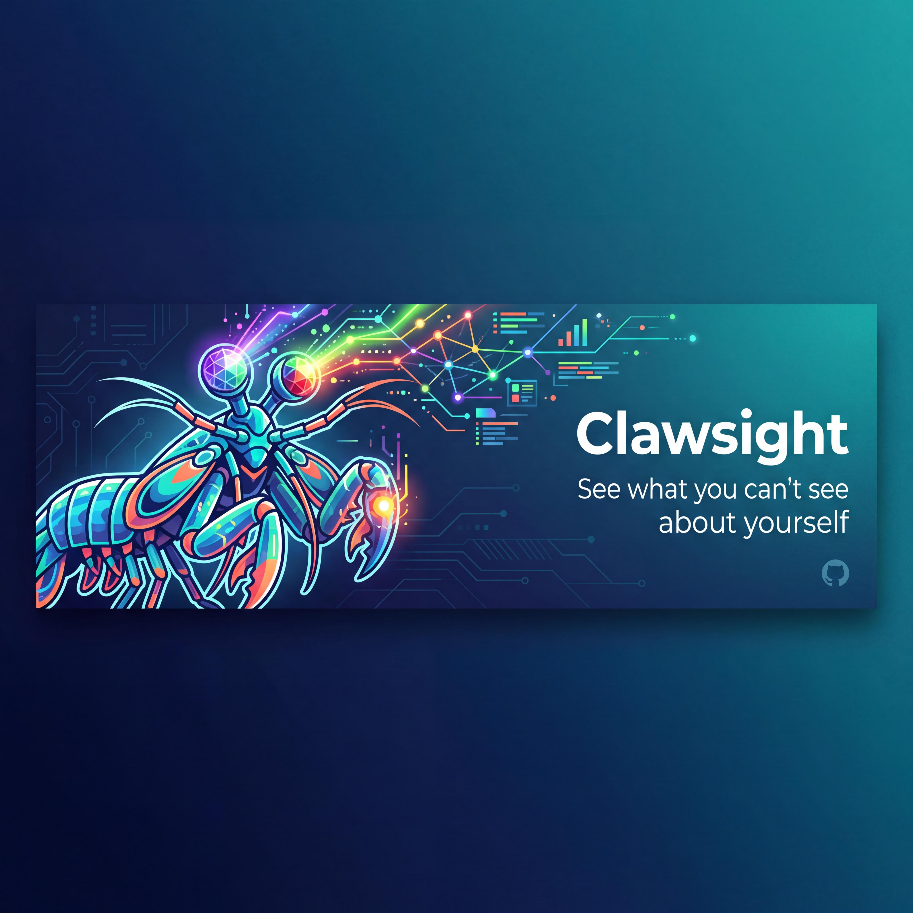

<p align="center">
  
</p>

<p align="center">
  <strong>Multi-source AI profile intelligence — cross-reference your data, discover your hidden strengths.</strong>
</p>

<p align="center">
  <a href="LICENSE"></a>
  
  
  
</p>

---

**Resume analyzers look at one source. Clawsight cross-references all of them.**

Your resume says "Java lead" but your GitHub is 90% Go. Three LinkedIn recommenders mention mentoring, but your resume never says "leadership." You have payment systems + distributed architecture + global experience — a triple combination that's extremely rare. These insights are invisible from any single source. They only emerge when you look across data streams.

Named after the **Mantis Shrimp** (螳螂虾) — the creature with 16 types of color receptors that sees dimensions invisible to all other animals. Clawsight does the same for your professional identity.

## Quick Start

```bash
# Install (one-time)
/install clawsight

# Import sources
/clawsight resume.pdf
/clawsight https://github.com/yourusername

# Discover insights (needs 2+ sources)
/clawsight insight

# Map your future potential
/clawsight potential
```

## Demo Output

After importing a resume + GitHub profile, `/clawsight insight` produces:

```
╔══════════════════════════════════════════════════════════╗
║  🔍 Cross-Source Insight: Behavioral-Declarative Gap     ║
╠══════════════════════════════════════════════════════════╣
║  Resume: "Backend Engineer, Java"                        ║
║  GitHub: 47 repos, 92% Go, contributor to 3 CNCF projects║
║                                                          ║
║  → Your identity has shifted to Go/cloud-native, but     ║
║    your resume still tells a Java story.                 ║
║    This gap may cost you roles you're already qualified  ║
║    for.                                                  ║
╚══════════════════════════════════════════════════════════╝

╔══════════════════════════════════════════════════════════╗
║  💎 Compound Advantage (rare combination)                ║
╠══════════════════════════════════════════════════════════╣
║  Payment Systems × Distributed Arch × Global Ops         ║
║  Market rarity: top 2% of senior engineers               ║
║                                                          ║
║  → This triple stack is in extreme demand for fintech    ║
║    companies expanding internationally.                  ║
╚══════════════════════════════════════════════════════════╝
```

## What It Does

Clawsight operates through three intelligence layers:

| Layer | Command | What You Get |
|-------|---------|-------------|
| **Profile** | `/clawsight <source>` | Multi-source import with cross-correlation |
| **Insight** | `/clawsight insight` | Hidden strengths, blind spots, behavioral-declarative gaps |
| **Potential** | `/clawsight potential` | Compound advantages × industry trends mapping |

### Supported Sources

| Source | Command | What It Captures |
|--------|---------|-----------------|
| Resume (PDF/text) | `/clawsight resume.pdf` | Career narrative, skills, achievements |
| GitHub | `/clawsight https://github.com/user` | Real tech stack, contribution patterns, projects |
| LinkedIn export | `/clawsight linkedin.zip` | Endorsements, recommendations, network signals |
| Personal website | `/clawsight https://yoursite.com` | Self-presentation, projects, writing |
| JSON Resume | `/clawsight resume.json` | Structured profile data |

> **LinkedIn Note**: Automated access is blocked by LinkedIn. Export your data via **Settings → Get a copy of your data** — Clawsight will parse the ZIP. See [docs/linkedin-guide.md](docs/linkedin-guide.md) for step-by-step instructions.

### Additional Commands

| Command | Description |
|---------|-------------|
| `/clawsight score` | Profile completeness and understanding level |
| `/clawsight refresh` | Re-fetch all sources, detect changes over time |

## How It Works

```
 ┌─────────┐  ┌─────────┐  ┌─────────┐  ┌─────────┐
 │ Resume  │  │ GitHub  │  │LinkedIn │  │ Website │
 └────┬────┘  └────┬────┘  └────┬────┘  └────┬────┘
      │            │            │             │
      └──────────┬─┴────────────┴─────────────┘
                 ▼
       ┌─────────────────────┐
       │  Parse & Normalize  │
       └─────────┬───────────┘
                 ▼
       ┌─────────────────────┐
       │  Cross-Source        │  ★ Core differentiator
       │  Reconciliation      │  Classifies 5 conflict types,
       │  Engine              │  resolves 4 automatically,
       └─────────┬───────────┘  turns contradictions → insights
                 ▼
       ┌─────────────────────┐
       │  ⛔ Privacy Preview  │  User confirms before any write
       └─────────┬───────────┘
                 ▼
    ┌────────────┼────────────┐
    ▼            ▼            ▼
┌────────┐ ┌──────────┐ ┌───────────┐
│USER.md │ │MEMORY.md │ │projects/* │
└────────┘ └──────────┘ └───────────┘
                 │
        ┌────────┴────────┐
        ▼                 ▼
   ┌─────────┐     ┌───────────┐
   │ Insight │     │ Potential │
   │ Engine  │     │ Discovery │
   └─────────┘     └───────────┘
```

See [docs/architecture.md](docs/architecture.md) for the full technical deep dive.

## Scene Skills

Clawsight generates profile data. **Scene Skills** consume it for specialized analysis:

| Skill | Description |
|-------|-------------|
| [career-mirror](skills/career-mirror/) | Career direction analysis with compound advantage mapping |

<details>
<summary>Planned Scene Skills</summary>

- **tech-compass** — Technology learning roadmap based on your stack + market trends
- **writing-voice** — Write content in your authentic voice
- **learning-path** — Personalized learning plan from skill gaps
- **stakeholder-briefer** — Quick context briefs for new collaborators

</details>

## Documentation

| Doc | Content |
|-----|---------|
| [Architecture](docs/architecture.md) | System design, pipeline, data flow |
| [Schema](docs/schema.md) | Canonical extraction schema |
| [Scoring](docs/scoring.md) | Profile completeness scoring |
| [Templates](docs/templates.md) | Output templates |
| [User Journey](docs/user-journey.md) | Interaction lifecycle |
| [LinkedIn Guide](docs/linkedin-guide.md) | LinkedIn data export steps |
| [Changelog](docs/changelog.md) | Version history |

## Roadmap

- [x] **v0.3** — Multi-source engine + Pure Skill rewrite
- [x] **v0.4** — Insight deepening + LinkedIn recommendations + refresh
- [x] **v0.5** — Potential discovery + dialogue enrichment + career-mirror
- [ ] **v1.0** — OpenClaw profile standard + 5 Scene Skills + Hindsight integration

## Contributing

Contributions are welcome! Here's how you can help:

1. **Build a Scene Skill** — Create a new skill under `skills/` that consumes Clawsight's profile data for specialized analysis. See [career-mirror](skills/career-mirror/) as a reference.
2. **Add a data source parser** — Propose a new source type (e.g., Stack Overflow, Dribbble) by opening an issue.
3. **Improve cross-source heuristics** — The reconciliation rules in SKILL.md can always be sharpened with real-world edge cases.
4. **Fix bugs & docs** — Typos, unclear instructions, broken examples — all PRs welcome.

```bash
# Fork → Clone → Create branch
git checkout -b feature/my-scene-skill

# Make changes, then
git push origin feature/my-scene-skill
# Open a PR
```

## License

[MIT](LICENSE) — use it, modify it, ship it.
